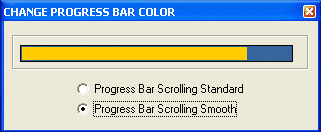

<div align="center">

## Change Progress Bar Color


</div>

### Description

Change progress bar color ( back and bar color ) with one API function ...
 
### More Info
 


<span>             |<span>
---                |---
**Submitted On**   |2003-05-08 16:10:04
**By**             |[CoRySus](https://github.com/Planet-Source-Code/PSCIndex/blob/master/ByAuthor/corysus.md)
**Level**          |Intermediate
**User Rating**    |4.5 (36 globes from 8 users)
**Compatibility**  |VB 6\.0
**Category**       |[Windows API Call/ Explanation](https://github.com/Planet-Source-Code/PSCIndex/blob/master/ByCategory/windows-api-call-explanation__1-39.md)
**World**          |[Visual Basic](https://github.com/Planet-Source-Code/PSCIndex/blob/master/ByWorld/visual-basic.md)
**Archive File**   |[Change\_Pro158525582003\.zip](https://github.com/Planet-Source-Code/corysus-change-progress-bar-color__1-45353/archive/master.zip)

### API Declarations

```
' API DECLARATION "USER 32"
Private Declare Function PostMessage Lib "user32" Alias "PostMessageA" _
 (ByVal hwnd As Long, ByVal wMsg As Long, ByVal wParam As Long, _
  ByVal lParam As Long) As Long
' CONSTANTS
Const PBM_SETBARCOLOR = &H409
Const PBM_SETBKCOLOR = &H2001
```


